Exercise Sheet 2
================


This exercise sheet is an [R Markdown](https://rmarkdown.rstudio.com/)
file. To generate an HTML file from it, use the **Knit** button in
RStudio.

The *European Soccer Database* contains data on more than 25.000
national football matches from the best European leagues. The aim of
this exercise is to present interesting relationships in R using
exploratory data analysis and visualization.

First you need to access some tables in the database. To do so,
[download the
database](https://1drv.ms/u/s!AlrZt1pKHg25gch_i-b1mAbOtWU44Q?e=AMhg1B)
and place it in the same folder as this .Rmd file. You can then use the
`RSQLite::dbConnect()` function to connect to the database. To access a
particular database table and convert it to a `data.frame`, you can use
the `tbl_df(dbGetQuery(connection, 'SELECT * FROM table_xyz'))` command
as displayed below.

``` r
# Load libraries (they need to be installed on the first run via install.packages)
# You do not need to use these libraries, though
library(RSQLite)
library(stringr)
library(ggplot2)
library(dplyr)
library(tidyr)
library(forcats)
library(lubridate)

# connect to database
con <- dbConnect(SQLite(), dbname = "EuropeanSoccer.sqlite")

# table queries
match <- as_tibble(dbGetQuery(con, "SELECT * FROM Match"))
league <- as_tibble(dbGetQuery(con, "SELECT * FROM League"))
```

*Example code for a visualization: Below, you can find a code chunk that
contains code to create a basic scatterplot.*

``` r
# Example visualization...
match %>%
  ggplot(aes(x = home_team_goal, y = away_team_goal)) +
  geom_point(alpha = 1/50, size = 10)
```

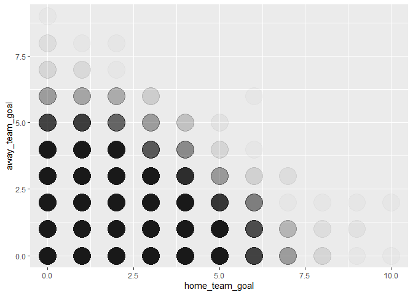<!-- -->

1.  The first leagues of Spain, England, Germany and Italy are
    considered the four most attractive football leagues in Europe. In
    which of the four leagues were the most or the fewest goals scored
    per game on average?

``` r
# 1. Определяем список интересующих нас лиг
target_leagues <- c('Spain LIGA BBVA', 'England Premier League', 'Germany 1. Bundesliga', 'Italy Serie A')

# 2. Подготовка данных и расчет среднего
task1_results <- match %>%
  # Присоединяем таблицу лиг, чтобы сопоставить ID с названиями
  left_join(league, by = c("league_id" = "id")) %>%
  # Оставляем только нужные 4 лиги
  filter(name %in% target_leagues) %>%
  # Считаем сумму голов для каждой строки (матча)
  mutate(total_goals = home_team_goal + away_team_goal) %>%
  # Группируем данные по названию лиги
  group_by(name) %>%
  # Вычисляем среднее значение
  summarise(avg_goals = mean(total_goals)) %>%
  # Сортируем для удобства отображения на графике
  arrange(desc(avg_goals))

# 3. Визуализация результата
ggplot(task1_results, aes(x = reorder(name, -avg_goals), y = avg_goals, fill = name)) +
  geom_col(show.legend = FALSE) +
  # Добавляем подписи с округлением до 2 знаков
  geom_text(aes(label = round(avg_goals, 2)), vjust = -0.5, size = 5) +
  labs(
    title = "Average Goals per Match (Top 4 Leagues)",
    x = "League",
    y = "Average goals per match",
    caption = "European Soccer Database"
  ) +
  theme_minimal() +
  # Масштабируем ось Y для наглядности разницы
  coord_cartesian(ylim = c(2, 3))
```

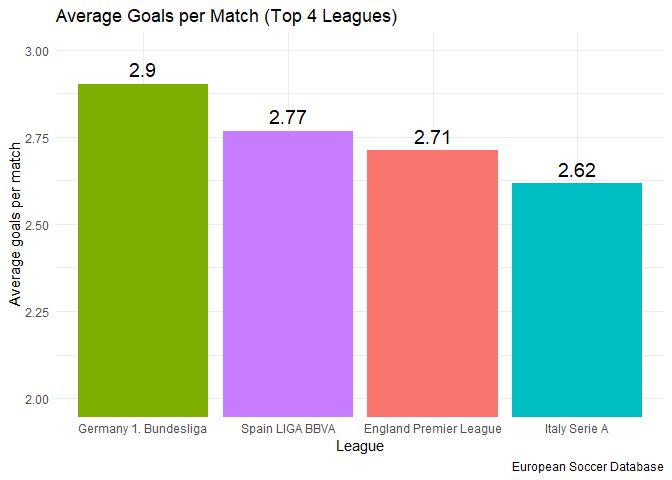<!-- -->

2.  In this task, we refer again to the four most attractive European
    leagues from Task 1. Compare the average and the standard deviation
    of goals scored per match between the four most attractive European
    leagues on one side and the remaining leagues on the other side.

``` r
# 1. Список топовых лиг
# target_leagues <- c('Spain LIGA BBVA', 'England Premier League', 'Germany 1. Bundesliga', 'Italy Serie A')
# 2. Подготовка данных: создаем группы и считаем голы
task2_data <- match %>%
  left_join(league, by = c("league_id" = "id")) %>%
  mutate(group = if_else(name %in% target_leagues, "Top 4 Leagues", "Remaining Leagues")) %>%
  mutate(total_goals = home_team_goal + away_team_goal)

# 3. Расчет статистики: среднее (Mean) и стандартное отклонение (SD)
task2_stats <- task2_data %>%
  group_by(group) %>%
  summarise(
    avg_goals = mean(total_goals, na.rm = TRUE),
    sd_goals = sd(total_goals, na.rm = TRUE)
  )

# Выведем цифры в консоль для проверки
print(task2_stats)
```

    ## # A tibble: 2 × 3
    ##   group             avg_goals sd_goals
    ##   <chr>                 <dbl>    <dbl>
    ## 1 Remaining Leagues      2.68     1.65
    ## 2 Top 4 Leagues          2.74     1.69

``` r
# 4. Визуализация среднего и стандартного отклонения
ggplot(task2_stats, aes(x = group, y = avg_goals, fill = group)) +
  geom_col(width = 0.5, show.legend = FALSE) +
  # Добавляем планки погрешности, которые показывают стандартное отклонение
  geom_errorbar(aes(ymin = avg_goals - sd_goals, ymax = avg_goals + sd_goals), 
                width = 0.1, color = "black") +
  labs(
    title = "Comparison of Average Goals and SD",
    subtitle = "Top 4 Leagues vs. Remaining Leagues (with Standard Deviation bars)",
    x = "League Group",
    y = "Average Goals per Match"
  ) +
  theme_minimal()
```

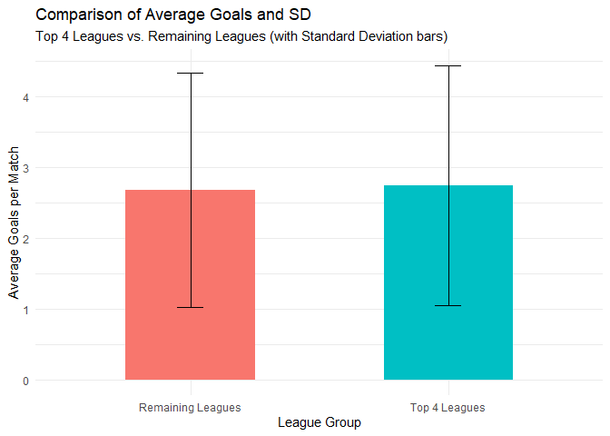<!-- -->

``` r
# Вариант с боксплотом (разброс через квартили)
ggplot(task2_data, aes(x = group, y = total_goals, fill = group)) +
  geom_boxplot(show.legend = FALSE) +
  labs(title = "Distribution of Goals per Match") +
  theme_minimal()
```

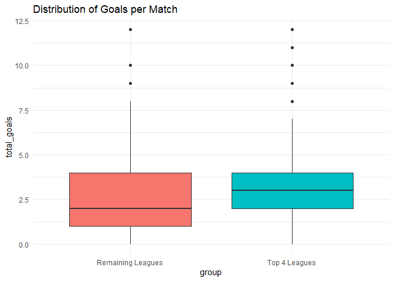<!-- -->

3.  Is there really a home advantage? Use a box plot to show the number
    of goals scored by home and away teams.

``` r
# 1. Подготовка данных: переводим таблицу в "длинный" формат
home_away_comparison <- match %>%
  # Выбираем только нужные колонки с голами
  select(home_team_goal, away_team_goal) %>%
  # Создаем одну колонку для типа команды и одну для количества голов
  pivot_longer(cols = everything(), 
               names_to = "team_type", 
               values_to = "goals") %>%
  # Для красоты переименуем категории
  mutate(team_type = if_else(team_type == "home_team_goal", "Home Team", "Away Team"))

# 2. Построение боксплота
ggplot(home_away_comparison, aes(x = team_type, y = goals, fill = team_type)) +
  geom_boxplot(show.legend = FALSE) +
  scale_y_continuous(breaks = seq(0, 10, by = 1)) +
  labs(
    title = "Comparison of Goals: Home vs. Away",
    subtitle = "Analysis of Home Advantage across all matches",
    x = "Team Type",
    y = "Number of Goals"
  ) +
  theme_minimal()
```

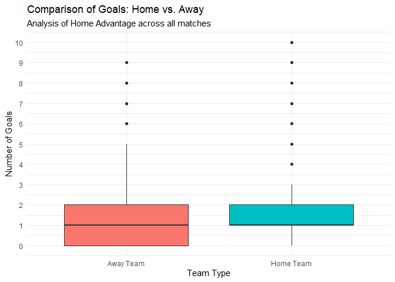<!-- -->

4.  *“All soccer players are fair-weather players!”* Check the assertion
    with a line chart: Do on average more goals fall per game in the
    summer months than in the rest of the year?

``` r
# 1. Обработка даты и расчет голов
monthly_stats <- match %>%
  # Превращаем текстовую дату в объект "Дата"
  mutate(date = ymd_hms(date)) %>% # dplyr функция mutate, lubridate функция ymd_hms, превращает текст в объект времени
  # Извлекаем номер месяца (1, 2, 3...)
  mutate(month_num = month(date)) %>%
  # Считаем сумму голов в каждом матче
  mutate(total_goals = home_team_goal + away_team_goal) %>%
  # Группируем данные только по месяцу (игнорируем год)
  group_by(month_num) %>%
  # Считаем среднее количество голов
  summarise(avg_goals = mean(total_goals, na.rm = TRUE))

# 2. Визуализация: Линейный график результативности по месяцам
ggplot(monthly_stats, aes(x = month_num, y = avg_goals)) +
  geom_line(color = "steelblue", linewidth = 1) +
  geom_point(color = "steelblue", size = 3) +
  # Настраиваем ось X, чтобы были видны все 12 месяцев
  scale_x_continuous(breaks = 1:12, labels = month.abb) +
  labs(
    title = "Average Goals per Match by Month",
    subtitle = "Testing the 'Fair-Weather Players' Assertion",
    x = "Month",
    y = "Average Goals"
  ) +
  theme_minimal()
```

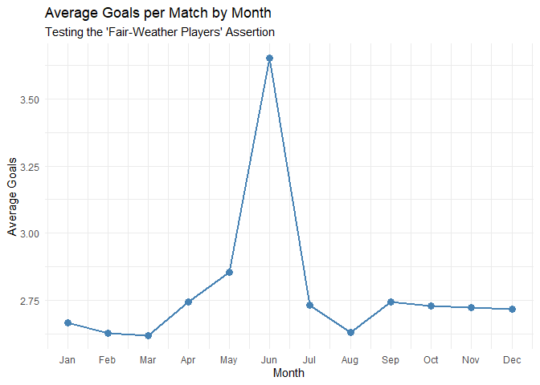<!-- -->

``` r
###########################################################
# 1. Подготовка хронологических данных 
timeline_stats <- match %>%
  mutate(date = ymd_hms(date)) %>%
  mutate(month_year = floor_date(date, "month")) %>%
  mutate(total_goals = home_team_goal + away_team_goal) %>%
  group_by(month_year) %>%
  summarise(avg_goals = mean(total_goals, na.rm = TRUE))

# 2. Создаем таблицу для закрашивания теплых месяцев
warm_shading <- data.frame(
  start = as.POSIXct(paste0(2008:2016, "-05-01")),
  end   = as.POSIXct(paste0(2008:2016, "-09-30"))
)

# 3. Построение графика
ggplot(timeline_stats, aes(x = month_year, y = avg_goals)) +
  # Добавляем прямоугольники закраски фоном
  geom_rect(data = warm_shading, 
            aes(xmin = start, xmax = end, ymin = -Inf, ymax = Inf), 
            fill = "orange", alpha = 0.15, inherit.aes = FALSE) +
  
  # Основная линия графика
  geom_line(color = "indianred", size = 0.8) +
  
  # Настройка оси X
  scale_x_datetime(
    date_breaks = "6 months",      
    date_labels = "%b"             
  ) +
  
  labs(
    title = "Average Goals per Match (2008 - 2016)",
    subtitle = "Shaded areas: warm months (May–September)",
    x = "Timeline",
    y = "Average Goals"
  ) +
  theme_minimal() +
  theme(axis.text.x = element_text(angle = 45, hjust = 1))
```

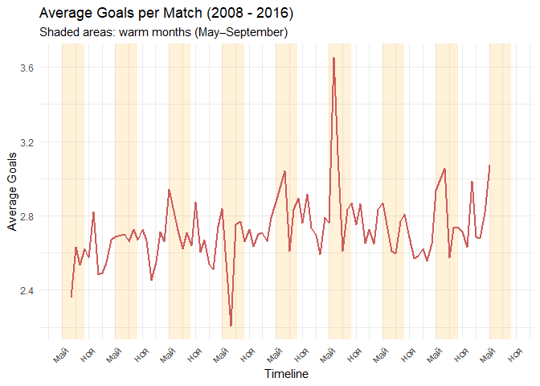<!-- -->

``` r
############################################################
analysis_data <- match %>%
  mutate(
    date = ymd_hms(date),
    month_num = month(date),
    total_goals = home_team_goal + away_team_goal,
    season_type = if_else(month_num >= 5 & month_num <= 9, "Warm", "Cold")
  )
# Kernel Density Estimation
ggplot(analysis_data, aes(x = total_goals, fill = season_type)) +
  geom_density(alpha = 0.5) +
  # Настраиваем ось X: от 0 до 12 с шагом 1
  scale_x_continuous(breaks = seq(0, 12, by = 1)) + 
  labs(
    title = "Estimated Density of Goals",
    x = "Total Goals",
    fill = "Season"
  ) +
  theme_minimal()
```

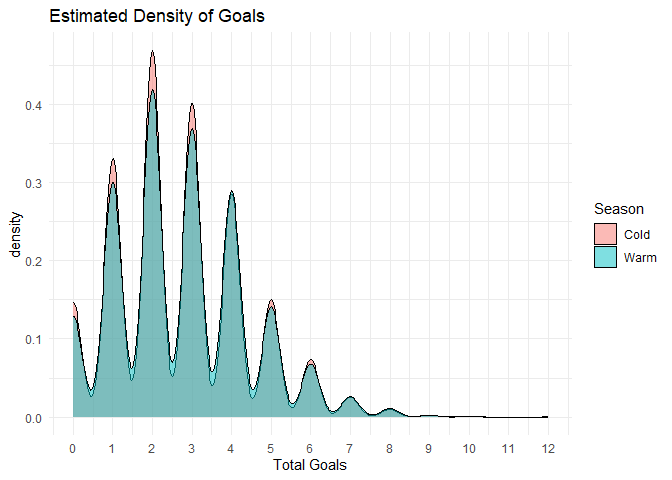<!-- -->

``` r
ggplot(analysis_data, aes(sample = total_goals)) +
  stat_qq() +
  stat_qq_line(color = "red") +
  facet_wrap(~season_type) +
  labs(title = "Normal QQ-Plot per Season") +
  theme_minimal()
```

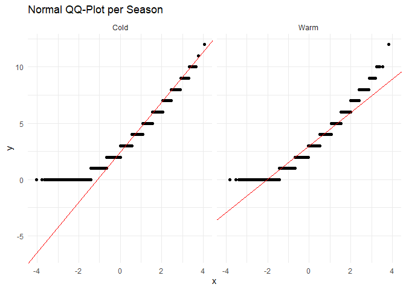<!-- -->

``` r
# 1. Сначала подготовим фактор с нужным порядком уровней
analysis_data$season_type <- factor(analysis_data$season_type, levels = c("Cold", "Warm"))

# 2. Параметрический t-test (односторонний)
# Мы тестируем, что вторая группа (Warm) больше первой (Cold)
t_result <- t.test(total_goals ~ season_type, 
                   data = analysis_data, 
                   alternative = "less") # так как Cold < Warm эквивалентно Warm > Cold
print(t_result)
```

    ## 
    ##  Welch Two Sample t-test
    ## 
    ## data:  total_goals by season_type
    ## t = -2.3843, df = 13314, p-value = 0.008563
    ## alternative hypothesis: true difference in means between group Cold and group Warm is less than 0
    ## 95 percent confidence interval:
    ##         -Inf -0.01711044
    ## sample estimates:
    ## mean in group Cold mean in group Warm 
    ##           2.689947           2.745127

``` r
# 3. Непараметрический тест Манна-Уитни (Wilcoxon Rank Sum Test)
wilcox_test_final <- wilcox.test(total_goals ~ season_type, data = analysis_data, alternative = "less")
print(wilcox_test_final)
```

    ## 
    ##  Wilcoxon rank sum test with continuity correction
    ## 
    ## data:  total_goals by season_type
    ## W = 67086078, p-value = 0.007455
    ## alternative hypothesis: true location shift is less than 0

5.  Use an estimated density function curve AND a QQ-Plot to check
    whether the `home_team_possession` variable is (approximately)
    normally distributed.

``` r
# 1. Подготовка данных (фильтруем пропуски, так как владение мячом есть не во всех строках)
possession_data <- match %>%
  select(home_team_possession) %>%
  filter(!is.na(home_team_possession))

# 2. График плотности (Density Plot)
ggplot(possession_data, aes(x = home_team_possession)) +
  geom_density(fill = "seagreen", alpha = 0.4) +
  # Накладываем теоретическую кривую нормального распределения N(mu, sigma^2)
  stat_function(fun = dnorm, 
                args = list(mean = mean(possession_data$home_team_possession), 
                            sd = sd(possession_data$home_team_possession)),
                color = "red", linetype = "dashed", size = 1) +
  labs(title = "Estimated Density of Possession",
       subtitle = "Green = Data, Red Dashed = Theoretical Normal Distribution",
       x = "Home Team Possession (%)", y = "Density") +
  theme_minimal()
```

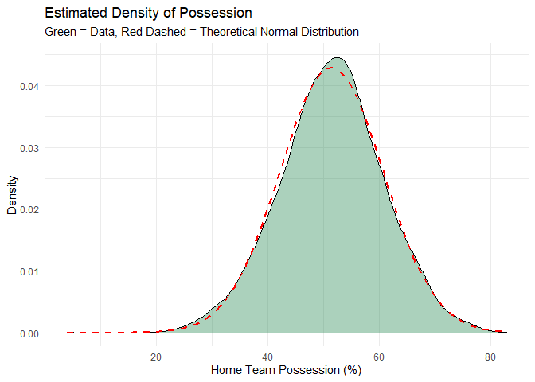<!-- -->

``` r
# 3. QQ-Plot
ggplot(possession_data, aes(sample = home_team_possession)) +
  stat_qq() +
  stat_qq_line(color = "red") +
  labs(title = "Normal Q-Q Plot",
       subtitle = "Checking for normality of possession percentage") +
  theme_minimal()
```

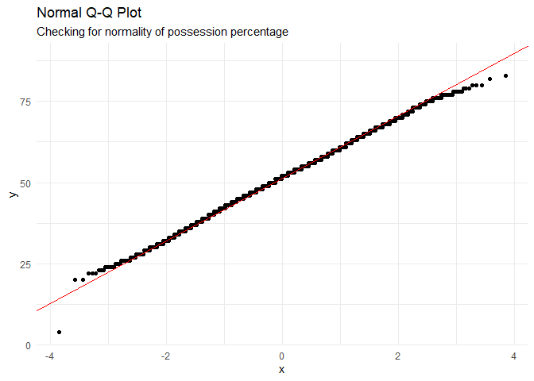<!-- -->

``` r
#############################################################################
library(moments)

skewness(possession_data$home_team_possession)
```

    ## [1] -0.07138009

``` r
kurtosis(possession_data$home_team_possession)
```

    ## [1] 3.0838

``` r
library(nortest)
lillie.test(possession_data$home_team_possession)
```

    ## 
    ##  Lilliefors (Kolmogorov-Smirnov) normality test
    ## 
    ## data:  possession_data$home_team_possession
    ## D = 0.030541, p-value < 2.2e-16

------------------------------------------------------------------------

Dataset:

- <https://1drv.ms/u/s!AlrZt1pKHg25gch_i-b1mAbOtWU44Q?e=AMhg1B>  
  (For database schema and explanation of variables, see:
  <https://www.kaggle.com/hugomathien/soccer>)
