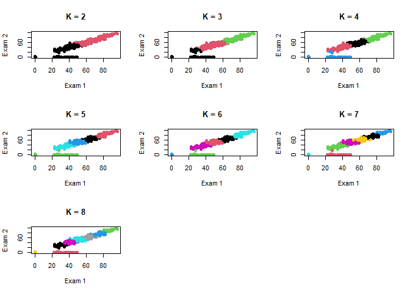
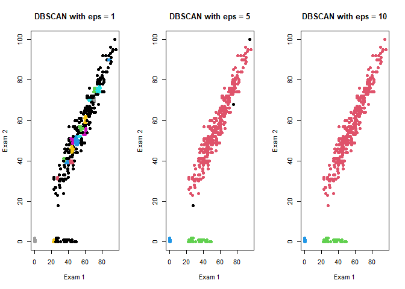
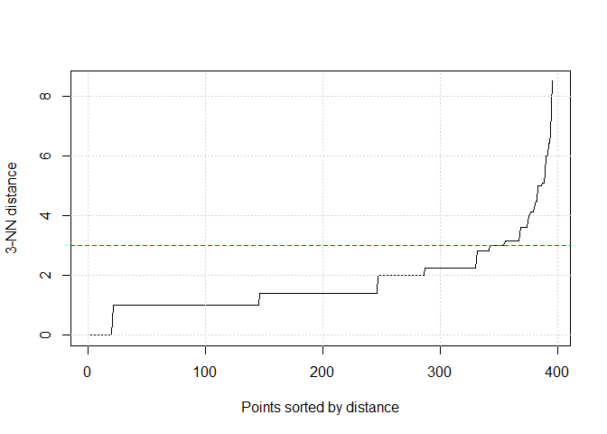
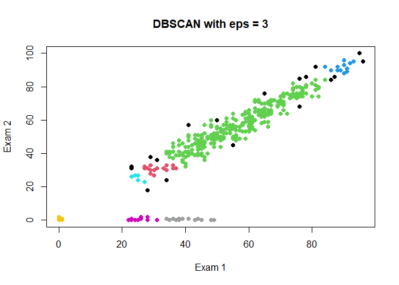
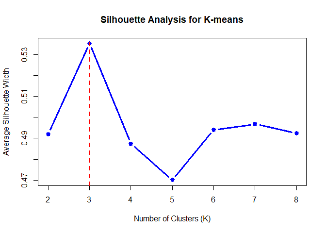
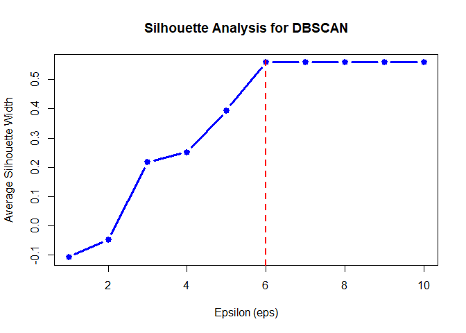
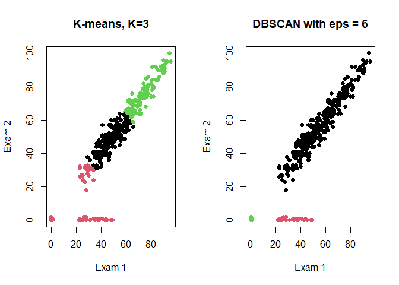
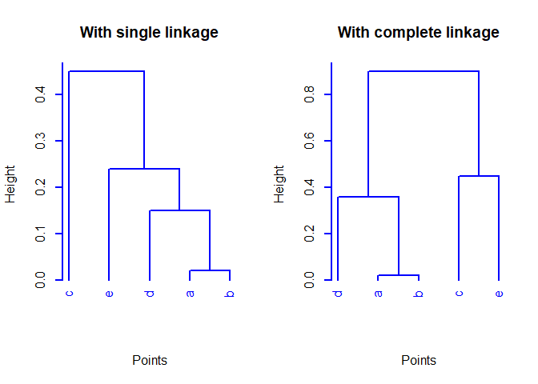

Exercise Sheet 3
================


``` r
# Set up libraries (make sure they are installed, first)
library(tidyverse)
library(stringr)
library(magrittr)
library(cluster)
library(dbscan)
```

1.  A school would like to group its pupils according to their
    performance at two intermediate examinations. It is assumed that
    there are at least 2 clusters of pupils. Load the file
    `clustering-student-mat.csv` from the exercise sheet’s ZIP archive.
    The file contains for each of the two exams the number of points
    scored for a total of 395 students.  
    Perform a $K$-means-Clustering for each $k\in \{2,3,\ldots,8\}$.
    Display the cluster assignments of the points in a scatter plot.
    (You may use `kmeans` from package `cluster`/`stats`.)

``` r
# Solution of task 1...
student <- read_csv("clustering-student-mat.csv")
par(mfrow = c(3, 3)) 
for (i in 2:8) {
  kmeans.res <- kmeans(student, i, iter.max = 10, nstart = 25)
  ddt <- cbind(student, cluster=kmeans.res$cluster)
  plot(ddt$Exam1, ddt$Exam2,
       col=ddt$cluster,
       pch=19,
       xlab="Exam 1",
       ylab="Exam 2",
       main = paste("K =", i))}
```

<!-- -->

2.  Aside from distance-based clustering models, there are also
    density-based models. However, they depend on input parameters, too,
    and the parameters can have a strong influence on the outcome. Based
    on the data from task 1, apply DBSCAN for each $eps\in \{1,5,10\}$,
    with $eps$ representing the epsilon threshold for
    density-connectivity. As the number of minimum points required in
    the $eps$ neighborhood of core points use $minPoints = 4$. Display
    the cluster assignments of the points in a scatter plot. (You may
    use `dbscan` from package `dbscan`.)

``` r
# Solution of task 2...
par(mfrow = c(1, 3)) 
for (i in c(1, 5, 10)) {
  dbscan.res <- dbscan(student, eps = i, minPts = 4)
  dd2 <- cbind(student, cluster=dbscan.res$cluster)
  plot(dd2$Exam1, dd2$Exam2,
       col=dd2$cluster + 1, # +1 для того, чтобы 0 (noise) не был черным
       pch=19,
       xlab="Exam 1",
       ylab="Exam 2",
       main = paste("DBSCAN with eps =", i))}
```

<!-- -->

``` r
#Extra
par(mfrow = c(1, 1))
# Строим график расстояний до 3-го ближайшего соседа
kNNdistplot(student, k = 3)
# Добавляем сетку для удобства определения координат
grid()
# Проводим красную пунктирную линию на уровне предполагаемого eps
abline(h = 3, col = "red", lty = 2)
```

<!-- -->

``` r
dbscan.res <- dbscan(student, eps = 3, minPts = 4)
dd2 <- cbind(student, cluster=dbscan.res$cluster)
plot(dd2$Exam1, dd2$Exam2,
     col=dd2$cluster + 1,
     pch=19,
     xlab="Exam 1",
     ylab="Exam 2",
     main = "DBSCAN with eps = 3")
```

<!-- -->

3.  For the clustering results from task 1 and 2, use the silhouette
    coefficient to find the optimal cluster parameters (i.e., for
    $K$-means the number of clusters $K$, and for DBSCAN the epsilon
    threshold for density-connectivity $eps$). (You may use `silhouette`
    from package `cluster`.)

``` r
# Solution of task 3...
par(mfrow = c(1, 1))
dist_matrix <- dist(student)
k_vek <- c()
sil_vek <- c()
for (i in 2:8) {
  kmeans.res <- kmeans(student, i, iter.max = 10, nstart = 25)
  sil_kmeans <- silhouette(kmeans.res$cluster, dist_matrix)
  avg_sil <- summary(sil_kmeans)$avg.width
  k_vek <- c(k_vek, i)
  sil_vek <- c(sil_vek, avg_sil)
}
optimal_k <- k_vek[which.max(sil_vek)]
plot(k_vek, sil_vek, 
     type = "b",
     col = "blue",
     pch = 19,
     lwd = 3,
     xlab = "Number of Clusters (K)", 
     ylab = "Average Silhouette Width", 
     main = "Silhouette Analysis for K-means")
abline(v = optimal_k, col = "red", lty = 2, lwd = 2)
```

<!-- -->

``` r
eps_vek <- c()
sil_vek <- c()
for (i in 1:10) {
  dbscan.res <- dbscan(student, eps = i, minPts = 4)
  sil_dbscan <- silhouette(dbscan.res$cluster, dist_matrix)
  avg_sil <- summary(sil_dbscan)$avg.width
  eps_vek <- c(eps_vek, i)
  sil_vek <- c(sil_vek, avg_sil)
}
optimal_k <- eps_vek[which.max(sil_vek)]
plot(eps_vek, sil_vek, 
     type = "b",
     col = "blue",
     pch = 19,
     lwd = 3,
     xlab = "Epsilon (eps)", 
     ylab = "Average Silhouette Width", 
     main = "Silhouette Analysis for DBSCAN")
abline(v = optimal_k, col = "red", lty = 2, lwd = 2)
```

<!-- -->

``` r
par(mfrow = c(1, 2))
kmeans.res <- kmeans(student, 3, iter.max = 10, nstart = 25)
dd <- cbind(student, cluster=kmeans.res$cluster)
head(dd)
```

    ##   Exam1 Exam2 cluster
    ## 1    28    31       2
    ## 2    27    31       2
    ## 3    41    51       1
    ## 4    71    75       3
    ## 5    52    50       1
    ## 6    76    75       3

``` r
plot(dd$Exam1, dd$Exam2,
     col=dd$cluster,
     pch=19,
     xlab="Exam 1",
     ylab="Exam 2",
     main = "K-means, K=3")

dbscan.res <- dbscan(student, eps = 6, minPts = 4)
dd2 <- cbind(student, cluster=dbscan.res$cluster)
plot(dd2$Exam1, dd2$Exam2,
     col=dd2$cluster,
     pch=19,
     xlab="Exam 1",
     ylab="Exam 2",
     main = "DBSCAN with eps = 6")
```

<!-- -->

``` r
par(mfrow = c(1, 1))
```

4.  The following distance matrix is given. Perform agglomerative
    hierarchical clustering with *single* und *complete* linkage.
    Display the result in a dendrogram. The dendrogram should represent
    the order in which the points are joined. (You may use `hclust` from
    package `cluster`/`stats`.)

``` r
dm <- tribble(~p1,~p2,~p3,~p4,~p5,
              0.00, 0.02, 0.90, 0.36, 0.53,
              0.02, 0.00, 0.65, 0.15, 0.24,
              0.90, 0.65, 0.00, 0.59, 0.45,
              0.36, 0.15, 0.59, 0.00, 0.56,
              0.53, 0.24, 0.45, 0.56, 0.00) %>% as.matrix()
rownames(dm) <- letters[1:5]
colnames(dm) <- letters[1:5]
knitr::kable(dm)
```

|     |    a |    b |    c |    d |    e |
|:----|-----:|-----:|-----:|-----:|-----:|
| a   | 0.00 | 0.02 | 0.90 | 0.36 | 0.53 |
| b   | 0.02 | 0.00 | 0.65 | 0.15 | 0.24 |
| c   | 0.90 | 0.65 | 0.00 | 0.59 | 0.45 |
| d   | 0.36 | 0.15 | 0.59 | 0.00 | 0.56 |
| e   | 0.53 | 0.24 | 0.45 | 0.56 | 0.00 |

``` r
# Solution of task 4...
par(mfrow = c(1, 2))
for (i in c("single", "complete")) {
hclust.res <- hclust(as.dist(dm), method = i)
plot(hclust.res, 
     main = paste("With", i, "linkage"), 
     axes = TRUE,
     hang = -1,
     col="blue",
     lwd = 2,
     xlab = "Points",
     sub = "")
}
```

<!-- -->

------------------------------------------------------------------------
